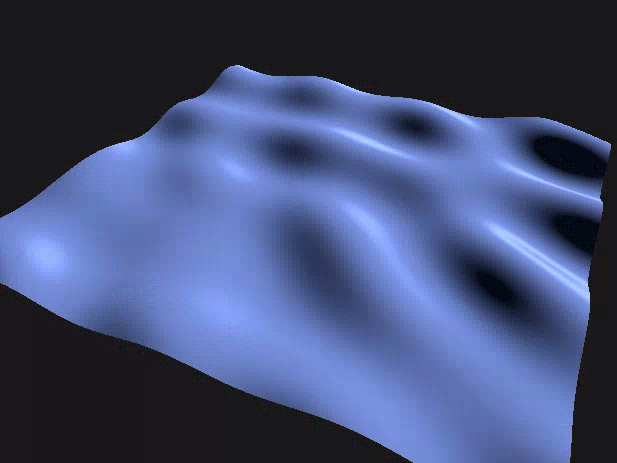
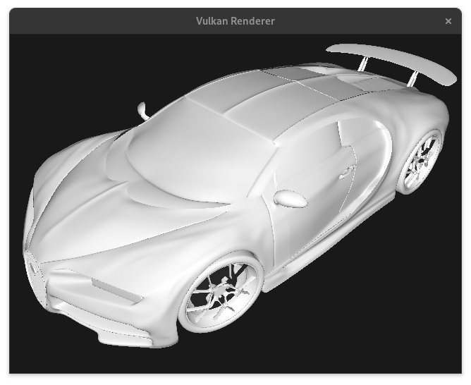

# Vulkan-Shaders
A 3D render engine using the Vulkan API.

<!---->
| Wave Simulation  | High Polygon Count Model |
|---|---|
|  |  |


## Getting Started

Ensure you meet the requirements before attempting to build and run, mainly a Vulkan Compatible GPU.

Cloning the repository:
```
git clone https://github.com/Sundance636/Vulkan-Shaders.git
```

### Dependencies

+ Vulkan SDK
+ CMake
+ glfw
+ glm
+ glslc


### Linux

Using your package manager of choice install the required packages
#### Arch Linux

```
sudo pacman -S vulkan-devel cmake glfw glm glslc
```

Once the Dependencies are installed, go to the root of the repo and execute the 'unixBuild.sh' shell script to build and run:
```
./unixBuild.sh
```
You can manually Run the executable from the 'build' Directory with:
```
./VulkanApp 
```

<p></p>


### Windows
(Coming soon, probably)

## Usage

When the program is started you will be presented to a scene where the camera is centered at the origin, you may move around to observe, and the terminal continuously will display some information about the current scene.

| Controls | |
|---|---|
|Arrow Keys | Pan the camera in the respective direction |
| W| Rotate camera up|
| A | Rotate camera left|
| S| Rotate camera down|
|D| Rotate camera right|
|E| Move camera forward|
|Q| Move camera backwards|


## Examples

**Vector Field Simulation**

Three Body Physics System, with vectors showing the effect of the gravitational forces.
 

**Sum of Sines Wave Approximation**

Classic Sum of Sines algorithm as Described in [GPU Gems 1](https://developer.nvidia.com/gpugems/gpugems/contributors)

https://github.com/user-attachments/assets/9c5dae8f-ce8d-4e1e-9397-d8b5f47d7e1e


